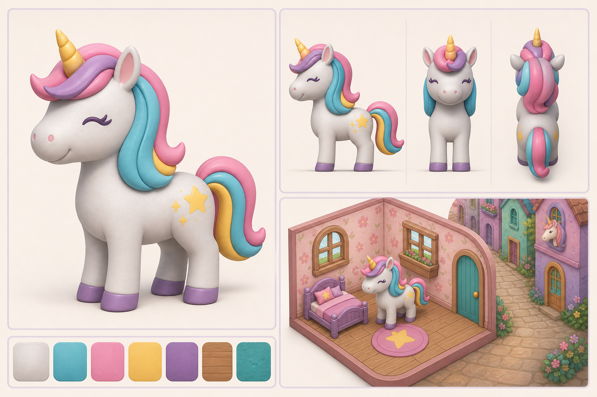

# Unicorn Arcade 3D art-direction checkpoint

Status: **proposal awaiting owner approval**. No production modeling, asset replacement, or Godot implementation should begin until this checkpoint is approved or revised.

## Original visual anchors

| Source | What it establishes |
| --- | --- |
| [Sparkle character](../../src/components/assets/sparkle.png) | Character identity: white/light-gray chibi foal, closed happy eyes, purple lashes, yellow horn and star mark, pastel cyan/pink/yellow mane and tail. Sparkle has no wings. |
| [Unicorn Alley](../../src/components/unicornAlley/unicornAlleyMap.jpeg) | Exterior world language: pastel European-fantasy alley, warm stone, teal/rose/lavender plaster, flowers, hand-painted storybook softness. |
| [Sparkle's room](../../src/components/assets/sparkleRoom.png) | Interior language: compact isometric dollhouse, rounded forms, warm wood, pink florals, and large mobile-readable shapes. |

The former glossy, winged app-store icon and feature graphic conflicted with Sparkle's in-game silhouette and the softer room/alley art. They were replaced after direction approval; the approved wingless character concept and calibrated orthographic plate are the model authorities.

## Proposed direction

The approved calibration and modeling evidence are tracked in:

- [Sparkle orthographic plate](sparkle-orthographic-v1.png)
- [Sparkle refinement ledger](sparkle-refinement-ledger.md)
- `../../concepts/sparkle_fit_v1.json`
- `../../previews/sparkle_v1/validation.json`

The root `feature.png` and `app_icon.png` now use this same wingless matte storybook direction.

The proposed visual language is a **pastel storybook arcade diorama**:

- Sparkle remains a compact chibi foal with a large rounded head, short muzzle, sturdy legs, oversized soft hooves, a short rooted horn, and a highly readable silhouette.
- The mane and tail become a few broad ribbon-like clumps. This preserves the cyan/pink/yellow color rhythm while remaining practical to model, rig, animate, and render on mobile.
- Materials are matte clay/toy PBR with subtle hand-painted variation, soft bevels, and restrained highlights. Color masses replace the original 2D outline without losing readability.
- Environments use dollhouse-scale isometric rooms and storybook alley façades with warm wood, pastel plaster, florals, rounded corners, and simple modular geometry.
- The palette stays soft and cozy. Neon belongs in small arcade accents and feedback effects, not across every surface.
- Sparkle does **not** gain wings. Other companions may retain their existing individual traits when their own concept sheets are prepared.

## 3D production constraints after approval

The side orthographic silhouette is the primary anatomical authority. Before sculpting, each character should receive a calibrated side/front/top sheet, neutral stance, explicit landmarks, cross-section targets, material classes, and a manifest suitable for the Concept Fitter workflow. Generated images are visual proposals only; they are not geometry or hidden-surface authority.

Godot-ready character delivery should include embedded asset roots, stable topology, UVs, material slots, rig and animation pivots, matched validation cameras, turntable renders, and silhouette/landmark comparison renders. Environment modules need documented grid scale, floor contact, pivots, collision proxies, and mobile texture budgets.

## Approval questions

1. Does the matte storybook-toy treatment feel like the right evolution of the original game?
2. Is Sparkle's shape appealing and recognizable enough, or should the model be closer to the flatter original proportions?
3. Should the final game lean more toward the cozy alley/room pastels, or toward the saturated neon marketing graphics?
